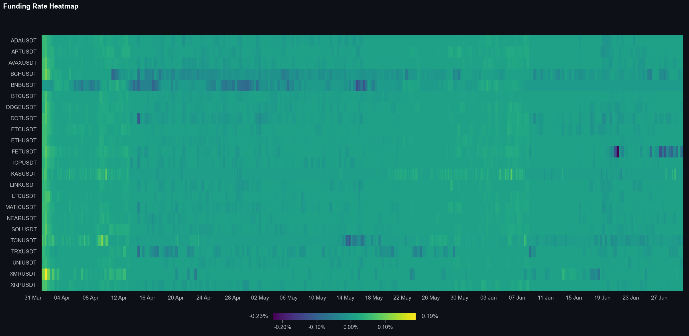
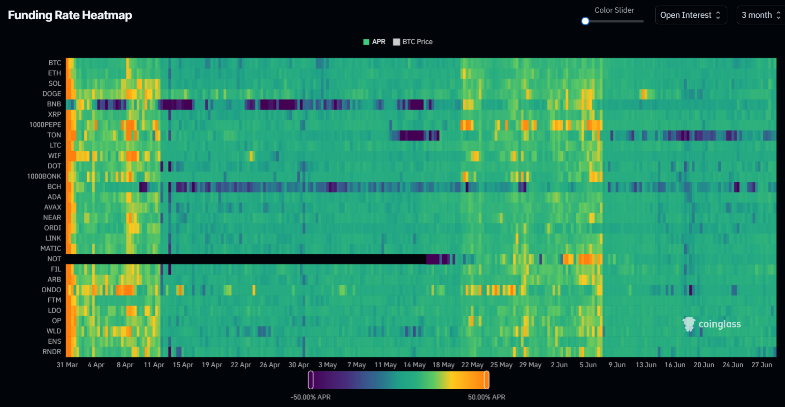

# Funding Rate Heatmap 📊

This is a simple Python script that generates a funding rate heatmap for the top 30 cryptocurrencies by volume using the style of [Coinglass](https://www.coinglass.com/FundingRateHeatMap). The heatmap uses data from the Binance API.

<p align="center">
  
  
  <a href="https://github.com/psf/black"></a>
</p>

---

## Introduction

This is a well known heatmap for cryptocurrency traders. The goal is to provide a quick overview of the funding rates of current popular cryptocurrencies on Binance. I used the chart found on [Coinglass](https://www.coinglass.com/FundingRateHeatMap) as a reference. The data is then plotted using Matplotlib and Seaborn.

## Installation ⚙️

The required packages to run this code can be found in the requirements.txt file. To run this file, execute the following code block after cloning the repository:

```bash
pip install -r requirements.txt
```

## Usage ⌨️

To generate the chart, simply run the script using the following command:

```bash
python src/main.py
```

The settings can be adjusted at the top of the main.py file.

## Example 📊

The following chart is an example of the output generated by the script.


### References 📚

The following image was used as a reference to create the funding rate heatmap.


## Other Projects 📦

This project is part of a series of projects that I have created. You can find the other projects in the following list:

- [Total Liquidation Chart](https://github.com/StephanAkkerman/liquidations-chart)
- [Bitcoin Rainbow Chart](https://github.com/StephanAkkerman/bitcoin-rainbow-chart)
- [Live Binance Charts](https://github.com/StephanAkkerman/live-binance-charts)
- [RSI Heatmap](https://github.com/StephanAkkerman/crypto-rsi-heatmap)
